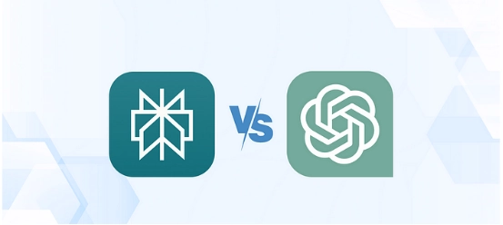

# Perplexity 与 ChatGPT 对比：哪个AI工具更适合你的实际需求？

---

当你打开电脑准备找点资料，或者想让AI帮你写点东西，面前摆着两个选择：Perplexity 和 ChatGPT。都是AI助手，但用起来感觉完全不一样。我花了些时间把这两个工具都试了个遍，发现它们各有各的门道。今天就跟你聊聊，这两个工具到底哪个更适合你手头的活儿——是需要快速找到靠谱信息，还是想要一个能陪你头脑风暴的创意伙伴。

---

## 先搞清楚这俩到底是干什么的

Perplexity 给自己的定位是"答案引擎"。什么意思？就是你问它问题,它直接给你答案,还附上信息来源。不像传统搜索引擎那样甩给你一堆链接让你自己翻。

ChatGPT 呢？更像个健谈的朋友。你跟它聊什么都行，它会记住你们之前说了什么，一来一回地跟你对话。写东西、改代码、出主意，这些活儿它都能接。

### ChatGPT 适合哪些人用？

说实话，ChatGPT 的用户群体挺杂的：

- **搞研究的**：遇到复杂话题需要理清思路时，它能帮你把事情掰开了说。
- **写代码的**：调试bug或者学新东西时，它就像个随叫随到的技术顾问。
- **上班族**：写报告、整理文档、回邮件，这些日常工作它都能搭把手。

### Perplexity 又是给谁准备的？

Perplexity 的目标用户更明确一些：

- **信息搜索者**：厌倦了在搜索引擎结果里翻来翻去，想直接看到简洁答案的人。
- **讲究效率的人**：希望在一个界面里既看到摘要又能查看原始资料。
- **追求准确的人**：需要带引用来源的精准回答，而不是模棱两可的说法。

## ChatGPT 能做什么？

OpenAI 这家公司现在基本不用介绍了。他们的 ChatGPT 已经成了很多人的日常工具。今年12月初的数据显示，ChatGPT 每周活跃用户超过3亿，每天收到的消息量超过10亿条。这数字说明什么？说明真的有很多人在用，而且用得很频繁。

使用 ChatGPT 有两种方式：

- **免费版**：从2021年11月就开始提供了。现在跑在 GPT-4o mini 模型上，基本的AI帮助都能提供，就是功能有限。
- **Plus 会员**：每月20美元。能用上 GPT-4 和 GPT-4o，还有 o1-preview 和 o1-mini。可以用 DALL-E 3 生成图片，访问各种高级功能。

### ChatGPT 的核心本事

**对话能力强**：ChatGPT 最大的特点就是能聊。它会记住你们的对话内容，不用每次都从头解释。GPT-4o 出来之后，它还能处理文字、图片和语音，你可以直接跟它说话。

**创意内容生成**：写博客、想社交媒体文案、编故事、写代码——这些创意活儿它都能干。虽然专业工具可能更精细，但对于一般的创意任务，ChatGPT 够用了。

**功能多样**：除了写东西，它还能解数学题、分析表格数据、翻译语言、用 DALL-E 画图。基本上是个全能助手。

**可以定制**：通过插件和自定义 GPT，你可以让它连接外部工具，或者针对特定任务进行调整。这对开发者和企业来说很实用。

## Perplexity AI 是什么来头？

Perplexity 的团队背景挺硬的——OpenAI、Meta 和 Coursera 的前员工,还有哈佛、斯坦福、伯克利等名校的优秀毕业生。它用的技术跟 ChatGPT 类似，都是自然语言处理和机器学习那套。

但 Perplexity 的定位不太一样。它不只是个聊天机器人，而是把搜索引擎和AI助手结合起来，叫"答案引擎"。你问它问题，它给你答案，还告诉你信息从哪来的。

Perplexity 也有两个版本：

- **免费版**：所有人都能用。可以用默认搜索引擎，每4小时有5次专业搜索机会。
- **Pro 会员**：每月20美元。能用 GPT-4o、Claude 3、Sonar Large（基于 Llama 3.1）和 Perplexity 自己的模型。可以上传分析无限文件，用 Playground AI、DALL-E、SDXL 等工具生成可视化答案。

### Perplexity 的独特优势

**实时网络搜索**：Perplexity 能从最新的网络资源里提取信息。不管是学术数据库、新闻文章还是普通网页内容，它给的答案都是最新的。

**标注信息来源**：这是 Perplexity 最大的亮点。每个回答都会附上引用来源，你可以验证信息的准确性。对于需要可靠资料的研究工作来说，这点特别重要。

**Copilot 交互功能**：Copilot 会通过提问来帮你优化搜索结果。在 GPT-4 的支持下，它能更准确地理解你的需求，帮你更高效地处理复杂问题。

**内容处理多样**：文本、代码、数学问题、表格——Perplexity 都能处理。它还能为长文章提供摘要，用通俗的语言解释复杂信息。

**用户体验友好**：界面设计简洁，有暗黑模式，支持 iOS 和 Android 应用，还有 Chrome 扩展。随时随地都能用。

## 两者的关键区别在哪？

说到底，👉 [选择合适的AI工具关键看你的使用场景](https://pplx.ai/ixkwood69619635)。

ChatGPT 更像个多面手。它擅长对话、创意、内容生成。你可以跟它聊天、让它帮你写东西、解决各种问题。它的知识库很广，支持多种语言，还能处理文字、图片、语音等多种输入方式。

Perplexity 则更专注。它的强项是快速、准确地找信息，而且每个答案都有来源支持。如果你需要做研究、查资料、验证信息,Perplexity 更靠谱。它的搜索功能是实时的，引用来源清晰，特别适合需要准确信息的场景。

简单说：
- **需要创意、写作、对话**？选 ChatGPT。
- **需要准确信息、研究资料、验证来源**？选 Perplexity。

## 几个常见问题

**Perplexity 是用 ChatGPT 做的吗?**

是的，Perplexity 使用了 OpenAI 的语言模型，但也整合了其他模型。

**两者最大的区别是什么？**

Perplexity 使用多种模型（Claude 3.5、GPT-4o、Llama 3.1 等），而 ChatGPT 完全基于 OpenAI 的 GPT 系列模型。

**处理图片、语音、PDF 这些,两者有什么不同？**

ChatGPT 在多模态输入方面更强，可以处理语音和图像交互。Perplexity 主要专注于文本数据，虽然支持文件上传，但在语音和图像交互方面不如 ChatGPT。

---

## 最后说两句

选 Perplexity 还是 ChatGPT，真的要看你具体要干什么。

如果你经常需要查资料、做研究、验证信息，Perplexity 是更好的选择。它给的答案有来源支持，搜索是实时的，信息组织得也清楚。对研究人员和专业人士来说，这些功能很实用。

如果你的工作更偏创意、内容制作、自动化处理，ChatGPT 更合适。它的对话能力强，知识面广，支持多种语言和输入方式，能满足各种不同的需求。

说白了，没有绝对的"更好"，只有"更适合"。你是需要一个严谨的研究助手，还是一个灵活的创意伙伴？想清楚这个问题，答案就出来了。当然，👉 [如果想同时体验两种工具的优势](https://pplx.ai/ixkwood69619635)，也有整合多个AI模型的平台可以选择，这样就不用在两者之间纠结了。
